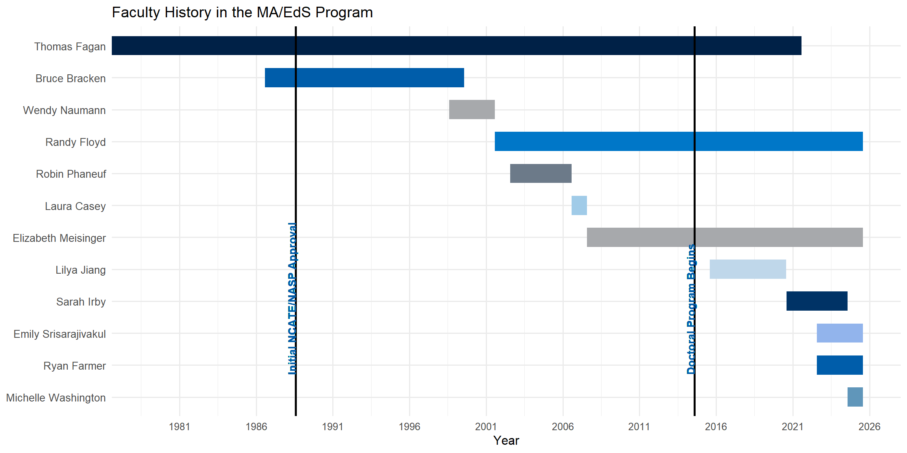

# Program History {#history}

The history of the School Psychology Programs at The University of Memphis dates primarily from 1975 and is closely tied to the histories of the Department of Psychology and the College of Education (COE).  While school-clinical psychology offerings and an MA degree program were available during the period 1960-1975, a jointly sponsored MA/EdS program (Department of Psychology and COE) was formally initiated in 1976.  It was an outgrowth of changes in the requirements for Tennessee State Department of Education certification (now licensure) of school psychologists in Tennessee (circa 1975) and the need for a revised school psychology program at what was then called Memphis State University.  The revised program, a 45 semester hour MA degree, was developed by a School Psychology Coordinating Committee (SPCC), established at the request of the Vice President for Academic Affairs. The SPCC functioned as the policy-making body for the jointly sponsored MA/EdS program until August 2015.  The new MA program was the first instance of a school psychology specific degree and the hiring of faculty in the area of school psychology.  Dr. Thomas Fagan, the first bona fide school psychologist faculty member, was hired for the 1976-1977 school year.  Dr. Bruce Bracken joined the faculty in 1986 and left in 1999.  Dr. Wendy Naumann served from 1998-2001.  Dr. Randy Floyd joined the program in fall 2001, Dr. Robin Phaneuf served from 2002-2006 and Dr. Laura Casey served in her position on an interim basis in 2006-2007 as a visiting assistant professor.  Dr. Elizabeth Meisinger joined the faculty in fall 2007 and Dr. Xu (Lilya) Jiang joined the faculty in fall 2015 and left in June 2020.  Dr. Sarah Irby was hired as a clinical assistant professor in fall 2020 and in fall 2021 was appointed interim director of the MA/EdS program when Dr. Fagan retired as an emeritus professor in August 2021.  Drs. Emily Srisarajivakul and Ryan Farmer joined the faculty in fall 2022. Dr. Ryan Farmer assumed the role of director of the MA/EdS program in fall 2023. Dr. Sarah Irby left the faculty in spring 2024. Dr. Michelle Washington joined the faculty in Fall 2024. Drs. Meisinger, Srisarajivakul, Washington, Farmer, and Floyd currently constitute the core program faculty and are supported by faculty in other areas of the Psychology Department, the COE, and local practitioners who assist with instruction and field supervision. Faculty appointment history is displayed in figure \@ref(fig:fachistory). 

(\#fig:fachistory)Timeline of MA/EdS Program Faculty.

Administered from the Psychology Department, the jointly sponsored MA/EdS program was indirectly overseen by the Dean of the COE and the Chair of the Psychology Department.  The MA/EdS program was governed by a 10-member School Psychology Coordinating Committee (SPCC; 4 members chosen from Psychology, 4 chosen from the COE, and 2 students).  All policies and curricula related to this program were the responsibility of the committee and were implemented by the MA/EdS program Director. The Associate Dean for Graduate Studies served as the program's primary contact in the COE. The SPCC developed a set of policy statements for the program as well as the original 45 semester hour Master's degree in 1975-1976 and the revised versions of those policies appear in this Handbook. The current 60-66 semester hour combined MA/EdS degree curriculum was initiated in 1982; the one-school year internship requirement was part of the EdS having previously been one semester. The PhD program was initiated in 1991 but governed by the policies of the Psychology Department's PhD major.  Program curricula and requirements for the different programs (MA/EdS and PhD) were determined entirely by the SPCC and by the Psychology Department, respectively. Starting in the fall of 2014, the directorship of the two programs was split with Dr. Fagan continuing as the director of the MA/EdS program and Dr. Floyd assuming the directorship of the PhD program. The programs continued to overlap in several areas of the curriculum and other areas (e.g., School Psychology Association, SPCC representation, field placements). 
  
In the summer of 2015 at a meeting of the core faculty with the UM Provost, the Interim Dean of the College of Education, and the chair of the Department of Psychology, it was agreed to restructure the governance of the MA/EdS program by drawing it into the governance of the Psychology Department. A revised School Psychology Program Committee (SPPC) was created to oversee the MA/EdS and the MS/PhD programs. The 2015 restructured governance arrangement retains the separate directorships, and the chair of the SPPC rotates among the two directors. The revised structure appears in this Handbook in Section III: Program Policies, Chapter \@ref(sppc) for more details.
  
With the change in governance, some changes were also made to the curriculum. For several years the program struggled to have certain courses in the COE offered on a regular basis and/or to focus the content more toward the needs of the school psychology students. This was especially true of courses in counseling theory and academic interventions. With the addition of a fourth school psychology faculty member, it was feasible to shift the content of those intervention courses into the core sequence of school psychology (7/8800 courses). Additional optional courses were also recommended in some areas (e.g., research design) and two intervention electives from counseling, special education, and educational psychology were added. The revised curriculum was in effect for students entering in fall, 2016 through spring 2025. In fall, 2025, minor adjustments to the curriculum were made to account for changes within the College of Education that impact course availability. Those changes are reflection in Section II: Program Description, Chapter \@ref(curriculum) for more details. 
  
The MA/EdS program has been accredited by NASP/NCATE (now CAEP) since the 1970s and first received NCATE/NASP approval in 1988. This approval has been uninterrupted and is active through December 2024. In 2024, the National Association of School Psychologists (NASP) was recognized by the Council for Higher Education as an accrediting organization in 2023. The program's first self study and site visit for accreditation with NASP was completed during the 2024-2025 academic year; results are anticipated in fall 2025.
  
Accreditation of the PhD program from the American Psychological Association was awarded in fall, 2014 and is active until 2021 (extended due to COVID-19 pandemic); the program's accreditation was renewed in spring, 2024 and is active until 2034.
  
***
<small>*Last updated: July 11, 2025*</small>
